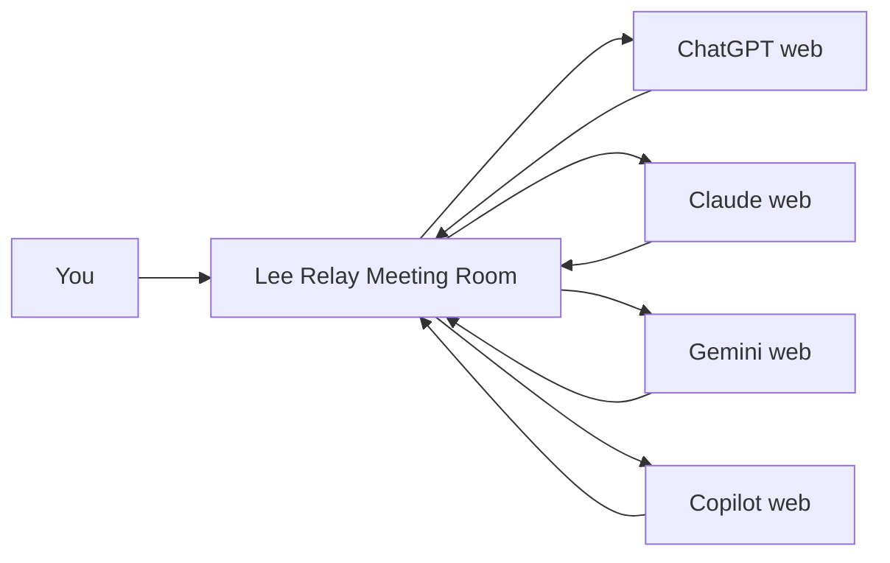
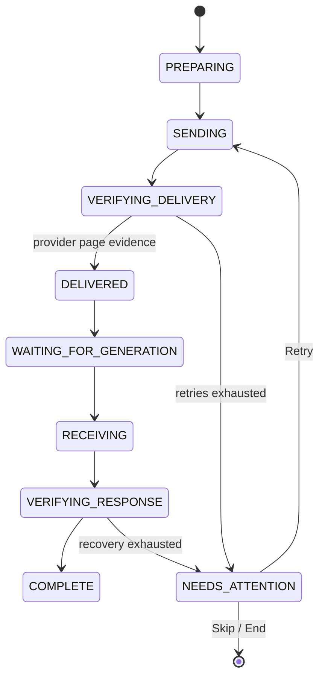

<div align="center">

# Lee Relay

### Put the AI websites you already use into one live meeting room.

**Online AI. Local orchestration. No API middleman.**

ChatGPT · Claude · Gemini · Copilot

[](#installation)
[](manifest.json)
[](LICENSE)
[](https://github.com/juwonllee2024-dotcom/lee-relay/actions/workflows/ci.yml)
[](https://github.com/juwonllee2024-dotcom/lee-relay/stargazers)
[](#development)

</div>

---

Lee Relay is a **browser-native multi-AI meeting room** for the normal web versions of ChatGPT, Claude, Gemini, and Microsoft Copilot.

Open the AI tabs you already use, connect them in Lee Relay's persistent Chrome Side Panel, and let them discuss the same topic while Lee Relay manages speaker order, shared context, delivery verification, retries, and the meeting transcript.

**No OpenAI API key. No Anthropic API key. No Google AI API key. No Microsoft API key. No Python server, Docker stack, or local model download is required.**

> Lee Relay does not replace the AI services themselves. The AI models remain online and each provider's account, subscription, usage limits, availability, and terms still apply.

## Why Lee Relay is different

Most multi-agent tools orchestrate model **APIs**. Lee Relay orchestrates the **AI websites already open in your browser**.

| | API-first agent frameworks | Lee Relay |
|---|---|---|
| Model connection | API credentials | Logged-in AI web tabs |
| Separate API billing | Usually | Not required by Lee Relay |
| Local server / runtime | Common | No separate relay server |
| Main interface | Terminal / custom app | Persistent Chrome Side Panel |
| Human joins discussion | Framework-dependent | Built into the meeting room |
| Cross-provider meeting | Requires provider adapters/API setup | Select supported open tabs |
| Failure visibility | Framework-dependent | Transaction stages + Activity log |

## Highlights

- **🌐 Browser-native** — runs as a Chrome Manifest V3 extension.
- **🔑 No API keys required by Lee Relay** — it automates supported provider web UIs.
- **🤝 Multi-AI meetings** — start with 2 participants and expand up to 6.
- **📌 Persistent Side Panel** — switch between AI tabs without losing the control room.
- **🧠 Smart speaker routing** — round-robin by default; explicit participant addressing can route the next turn.
- **👤 Human in the loop** — type directly into the shared room at any point.
- **📜 Master transcript** — Lee Relay keeps a meeting-level conversation history independent of any one provider tab.
- **✅ Verified delivery** — clicking a Send button is *not* enough to mark a turn delivered.
- **🔄 Recovery engine** — late delivery checks, bounded retries, page re-attachment, and watchdog recovery.
- **🚨 No silent fake-LIVE state** — exhausted recovery becomes `NEEDS ATTENTION` with Retry / Skip / Reconnect controls.
- **🧩 Provider-neutral design** — current adapters support ChatGPT, Claude, Gemini, and Copilot.

## How it works



The orchestration state lives in the browser extension. The actual AI requests and responses still happen through the provider websites you choose.

## A turn is a transaction, not a click

Lee Relay v3 treats each AI turn as a verified transaction:



This exists because **`button.click()` is an action, not proof that an AI provider accepted the message**.

## Supported AI websites

| Provider | Website |
|---|---|
| ChatGPT | `chatgpt.com`, `chat.openai.com` |
| Claude | `claude.ai` |
| Gemini | `gemini.google.com` |
| Microsoft Copilot | `copilot.microsoft.com` |

Provider websites can change their DOM without notice. Lee Relay is intentionally transparent about this constraint: adapter maintenance may be needed after provider UI changes.

## Installation

**Requirements:** Google Chrome 120 or later and access to at least two supported AI web apps.

1. Download the latest Lee Relay release ZIP from [GitHub Releases](https://github.com/juwonllee2024-dotcom/lee-relay/releases).
2. Extract the ZIP.
3. Open `chrome://extensions`.
4. Turn on **Developer mode**.
5. Click **Load unpacked**.
6. Select the extracted folder containing `manifest.json` at its root.
7. Open at least two supported AI chats.
8. Click the Lee Relay toolbar icon to open the Side Panel.

## Start your first AI meeting

1. Select an open AI tab for participant 1.
2. Select a second AI tab for participant 2.
3. Optionally choose **+ Add AI** to expand the room, up to 6 participants.
4. Enter the meeting topic.
5. Press **Start Meeting**.
6. Watch the Side Panel show each participant's state and the shared transcript.
7. Type into **Say something to the room…** whenever you want to intervene.

### Smart routing

If a participant clearly addresses another participant by name, Lee Relay can route the next turn to that AI. Ambiguous mentions fall back to round-robin instead of guessing.

## Reliability model

Lee Relay v3 was rebuilt around failure visibility rather than optimistic automation.

**Delivery confirmation** prefers an observable outgoing user-message node. A secondary delivery signal is accepted only when the input clears *and* a new generation state begins after the pre-send baseline.

**Response correlation** is transaction-scoped using meeting, transaction, participant, and tab identity. A verified background delivery receipt remains authoritative even if a provider collapses or visually rewrites a long outgoing prompt.

**Recovery** includes idempotency checks before resend, bounded retries, content-script reattachment, a 30-second watchdog, and explicit `NEEDS ATTENTION` state when automation cannot prove success.

Read the deeper design notes in [Architecture](docs/architecture.md) and the recovery guide in [Troubleshooting](docs/troubleshooting.md).

## Privacy and online behavior

Lee Relay uses the online AI websites you select. Messages sent into a meeting are therefore transmitted to those providers under their own privacy policies and terms.

Lee Relay itself does **not require a separate Lee Relay cloud relay server or API-key proxy**. Meeting orchestration, state, and transcript management are performed by the browser extension using Chrome extension storage.

Do not interpret this as “all data stays on your device.” It does not: content intentionally sent to an AI participant is sent to that AI service.

See [PRIVACY.md](PRIVACY.md) for the precise model.

## Development

No runtime npm dependencies are required for the extension or test suite.

```bash
npm test
npm run check
npm run verify
```

The current suite contains **60 regression and structure tests** covering the meeting engine, transaction lifecycle, provider boundaries, routing, persistence, Side Panel architecture, and previously discovered failure modes.

### Repository layout

```text
.
├── background.js              # orchestration + Chrome extension service worker
├── content.js                 # provider-page automation boundary
├── meeting-engine.mjs         # meeting / participant / transcript state
├── transaction-engine.mjs     # verified turn lifecycle
├── router.mjs                 # smart speaker selection
├── provider-adapters.mjs      # provider selector contracts
├── sidepanel.html/.css/.js    # persistent meeting room UI
├── relay-core.mjs             # shared provider / normalization helpers
├── tests/                     # Node regression tests
├── scripts/                   # repository verification utilities
└── docs/                      # architecture, roadmap, troubleshooting
```

## Roadmap

Near-term priorities:

- Harden provider adapters against UI changes.
- Add exportable Markdown / JSON meeting transcripts.
- Add opt-in per-participant roles (critic, researcher, engineer, etc.).
- Improve routing beyond explicit-name addressing while keeping deterministic fallback behavior.
- Add better sanitized demo capture and onboarding.
- Explore additional browser AI providers without weakening the no-API-key core.

See [docs/roadmap.md](docs/roadmap.md).

## Contributing

Bug reports that include the provider, browser version, exact transaction stage, and sanitized Activity log are especially valuable.

Please read [CONTRIBUTING.md](CONTRIBUTING.md) before opening a pull request.

## Security

Please do **not** publish sensitive meeting transcripts, account data, cookies, auth tokens, or private screenshots in a public issue. See [SECURITY.md](SECURITY.md).

## Project status

Lee Relay is an **early public browser-automation project**. The orchestration and recovery engine is tested, but third-party web interfaces can change independently of this repository. Expect provider adapters to evolve.

## Disclaimer

Lee Relay is an independent open-source project and is not affiliated with, endorsed by, or sponsored by OpenAI, Anthropic, Google, or Microsoft. Product names and trademarks belong to their respective owners.

Users are responsible for complying with the terms, policies, and usage limits of the AI services they connect.

## License

MIT — see [LICENSE](LICENSE).


---

If Lee Relay is useful to you, **star the repository** — it helps more people discover the project and signals which direction is worth investing in.
