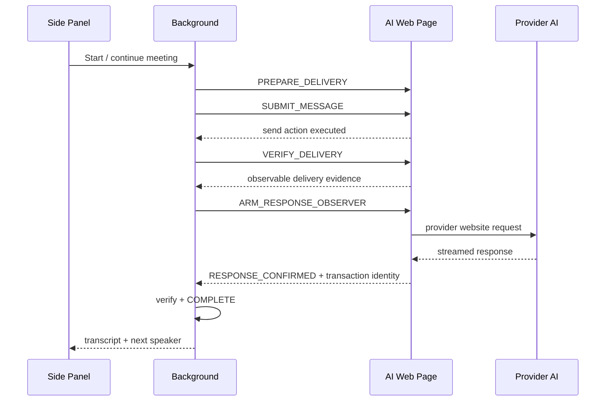

# Architecture

Lee Relay separates **meeting state**, **turn transactions**, **provider-page automation**, and **UI** so a provider DOM failure cannot silently masquerade as a completed AI turn.

## Components

### `background.js`

The Manifest V3 service worker is the orchestration authority. It serializes mutating meeting events, stores the active runtime state, schedules watchdog recovery, coordinates screenshots, and only advances the meeting when transaction evidence is sufficient.

### `meeting-engine.mjs`

Owns meeting-level data: participants, transcript, activity, statuses, durable state, and the 2–6 participant limit.

### `transaction-engine.mjs`

Owns the turn lifecycle. A turn is not complete because a DOM click succeeded. It moves through explicit stages and can enter `NEEDS_ATTENTION` when bounded recovery fails.

### `content.js`

Runs inside supported AI web pages. It locates provider input/output elements, prepares and submits messages, verifies delivery evidence, observes assistant responses, and reports transaction-scoped events to the background service worker.

### `provider-adapters.mjs`

Defines selector contracts for ChatGPT, Claude, Gemini, and Copilot. Provider websites are the most volatile external dependency in the project.

### `sidepanel.*`

Persistent user interface for participant binding, meeting transcript, user intervention, controls, statuses, and activity diagnostics.

## State flow

## Storage

- `chrome.storage.local`: durable meeting record/settings without stale live tab bindings.
- `chrome.storage.session`: current tab bindings and active transaction state.

This allows a browser restart to preserve meeting history while requiring live participants to rebind safely.

## Reliability principle

The central rule is:

> **Action is not evidence.**

Examples:

- Calling `.click()` is not delivery evidence.
- A changed assistant text node is not automatically proof that it belongs to the current transaction.
- A `LIVE` badge must not remain visible indefinitely after recovery is exhausted.

The project prefers explicit degraded states over silent optimistic progress.
